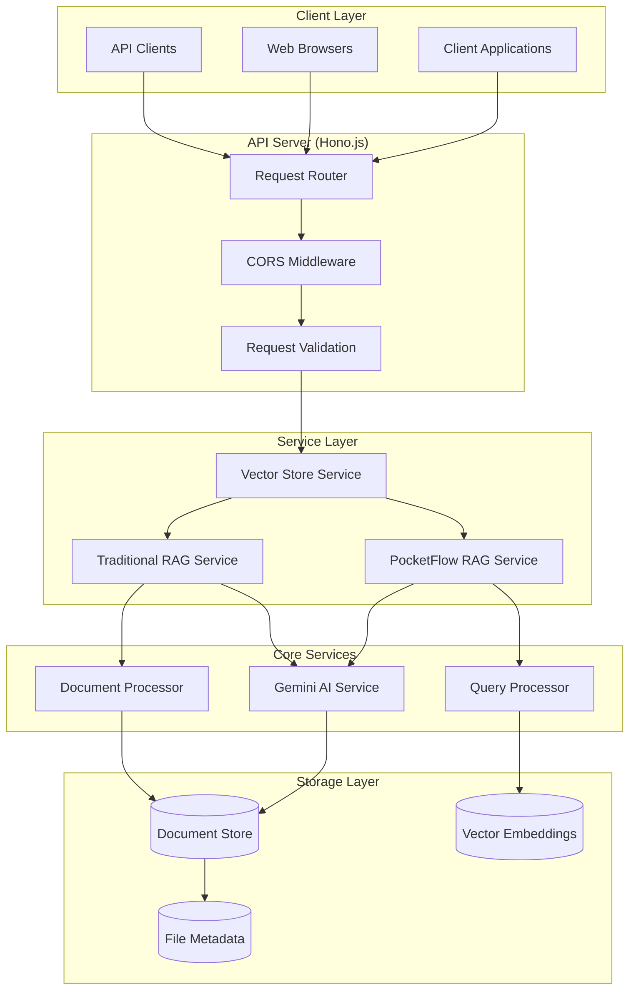
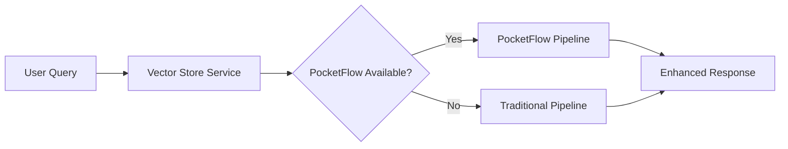
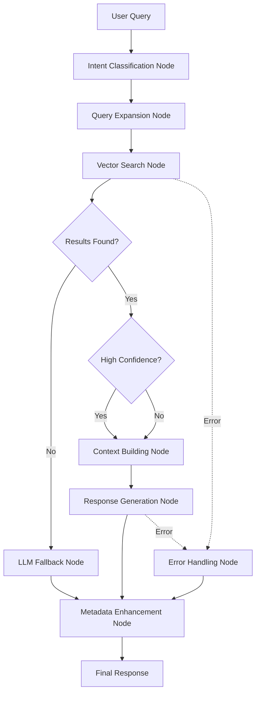
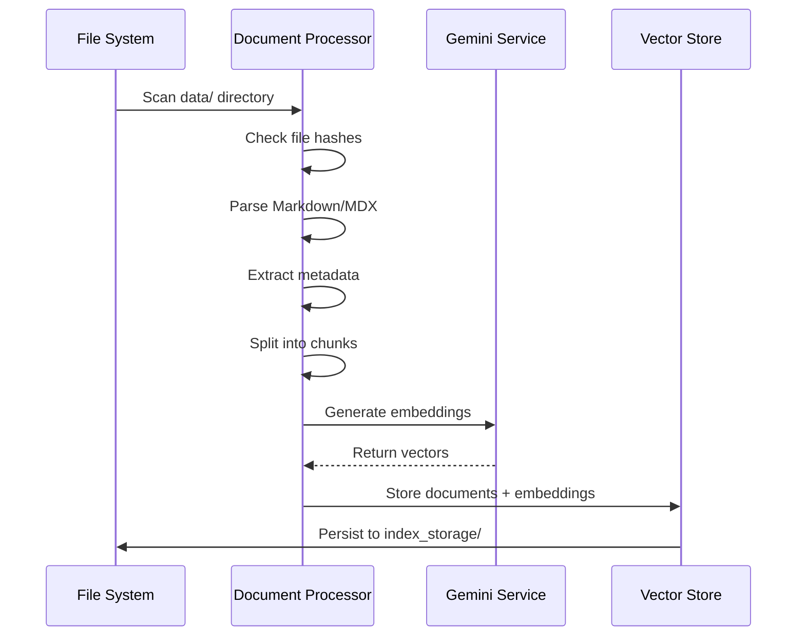
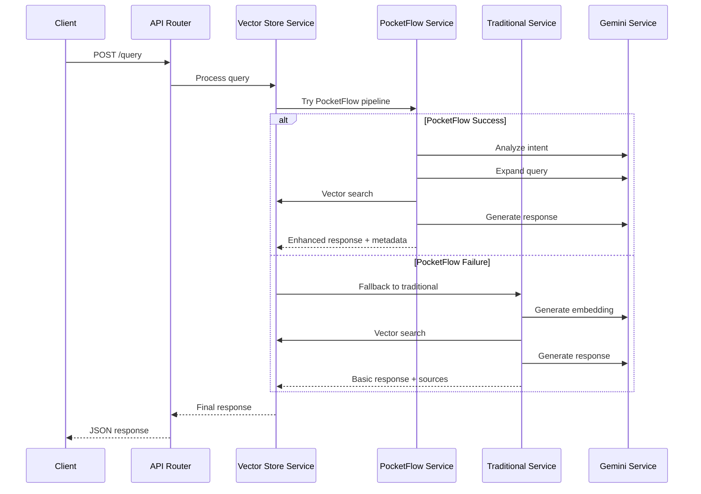

# System Architecture

Understanding the DocsRAG API's architecture helps you make the most of its capabilities and troubleshoot issues effectively.

## High-Level Architecture



## Core Components

### 1. Application Layer (`app.ts`)

The main application orchestrator that bootstraps and coordinates all services.

```typescript
class Application {
  private app: Hono;
  private vectorStoreService: VectorStoreService;
  private config = getEnvironmentConfig();
  
  async initialize(): Promise<void> {
    // 1. Initialize vector store
    // 2. Setup routes
    // 3. Configure middleware
  }
}
```

**Key Responsibilities:**
- Service initialization order management
- CORS configuration for cross-origin requests
- Error handling and graceful shutdown
- Environment configuration validation

### 2. Vector Store Service (`newVectorStore.ts`)

The central orchestration service that manages both RAG pipelines and decides which approach to use.



**Features:**
- **Dual Pipeline Management**: Coordinates both PocketFlow and traditional approaches
- **Automatic Fallback**: Seamlessly switches to traditional RAG when PocketFlow fails
- **Service Health Monitoring**: Tracks availability of all dependent services
- **Index Management**: Handles vector store initialization and updates

### 3. PocketFlow RAG Service (`pocketFlowRAG.ts`)

Advanced workflow-based RAG implementation using the PocketFlow framework for sophisticated query processing.

#### Workflow Architecture



#### Node Types

**Intent Classification Node**
- Analyzes query to determine user intent (how-to, troubleshooting, example, etc.)
- Provides confidence scores for routing decisions
- Supports 6 distinct intent types

**Query Expansion Node**
- Generates alternative phrasings using AI
- Expands acronyms and technical terms
- Creates semantic variations for better search coverage

**Vector Search Node**
- Performs similarity search against document embeddings
- Filters results by relevance threshold
- Returns ranked document chunks with metadata

**Context Building Node**
- Aggregates relevant document chunks
- Optimizes context length for LLM processing
- Maintains document hierarchy and relationships

**Response Generation Node**
- Synthesizes final answer using retrieved context
- Maintains consistent formatting and tone
- Includes source attribution when appropriate

**LLM Fallback Node**
- Handles queries outside documentation scope
- Provides general knowledge responses
- Clearly indicates when fallback is used

### 4. Traditional RAG Service (`customVectorStore.ts`)

Reliable fallback implementation using conventional RAG patterns.

**Process Flow:**
1. **Query Processing**: Basic query analysis and cleaning
2. **Embedding Generation**: Convert query to vector using Gemini
3. **Similarity Search**: Find most relevant document chunks
4. **Context Assembly**: Combine relevant chunks with metadata
5. **Response Generation**: Generate answer with source links
6. **Markdown Formatting**: Format response with proper links and structure

**Key Features:**
- **Docusaurus Integration**: Automatic URL conversion for documentation links
- **Source Attribution**: Clear source references with clickable links
- **Relevance Filtering**: Configurable similarity thresholds
- **Memory Efficient**: Streaming processing for large document sets

### 5. AI Services

#### Gemini Service (`gemini.ts`)

Handles all interactions with Google's Gemini AI model.

```typescript
class GeminiService {
  async generateEmbedding(text: string): Promise<number[]>
  async generateResponse(prompt: string): Promise<string>
  async classifyIntent(query: string): Promise<QueryIntent>
  async expandQuery(query: string): Promise<string[]>
}
```

**Capabilities:**
- **Text Embeddings**: Convert documents and queries to vector representations
- **Text Generation**: Synthesize coherent responses from context
- **Intent Classification**: Understand user query intentions
- **Query Expansion**: Generate semantic variations of user queries

#### Query Processor (`queryProcessor.ts`)

Enhances queries with additional context and analysis.

**Processing Pipeline:**
1. **Intent Detection**: Classify query purpose and confidence
2. **Language Detection**: Identify query language for localization
3. **Query Expansion**: Generate alternative phrasings
4. **Filter Extraction**: Parse explicit filters from query text
5. **Prompt Building**: Construct context-aware prompts for response generation

### 6. Document Processing

#### Document Processor (`documentProcessor.ts`)

Handles document ingestion, parsing, and chunking.

**Processing Pipeline:**
1. **File Discovery**: Scan directories for Markdown/MDX files
2. **Change Detection**: Use file hashing to identify modifications
3. **Content Parsing**: Extract text, metadata, and structure
4. **Smart Chunking**: Split documents into semantic chunks
5. **Metadata Extraction**: Parse frontmatter and document structure
6. **Embedding Generation**: Create vector representations

**Chunking Strategy:**
- **Section-based**: Split on headings for logical chunks
- **Size-aware**: Maintain optimal chunk sizes for AI processing
- **Overlap Management**: Minimal overlap to prevent redundancy
- **Context Preservation**: Maintain document hierarchy and relationships

## Data Flow

### Document Indexing Flow



### Query Processing Flow



## Configuration Management

### Environment Configuration (`config/environment.ts`)

Centralized configuration management with validation:

```typescript
interface EnvironmentConfig {
  geminiApiKey: string;      // Required: Gemini AI API key
  openaiApiKey: string;      // Required: OpenAI API key (fallback)
  port: number;              // Server port (default: 3001)
  dataDir: string;           // Documents directory (default: 'data')
  indexStorageDir: string;   // Vector storage (default: 'index_storage')
}
```

**Validation Features:**
- **Required Field Checks**: Ensures critical API keys are present
- **Type Conversion**: Handles string-to-number conversions safely
- **Default Values**: Provides sensible defaults for optional settings
- **Error Reporting**: Clear error messages for missing configuration

### Constants Management (`constants.ts`)

Centralized application constants:

```typescript
export const LOG_PREFIXES = {
  APP: '[APP]',
  VECTOR_STORE: '[VECTOR_STORE]',
  GEMINI: '[GEMINI]',
  POCKETFLOW: '[POCKETFLOW]',
  API: '[API]'
};

export const DEFAULT_PORTS = {
  API: 3001,
  DOCS: 3000
};
```

## Storage Architecture

### File-Based Vector Store

The system uses a file-based approach for simplicity and portability:

```
index_storage/
├── documents.json          # Processed document chunks
├── embeddings.json         # Vector embeddings
└── file_hashes.json        # Change detection metadata
```

**Benefits:**
- **No External Dependencies**: No need for vector databases
- **Portable**: Easy to backup, version, and deploy
- **Transparent**: Human-readable JSON format for debugging
- **Incremental**: Efficient updates without full rebuilds

**Scaling Considerations:**
- **Memory Usage**: ~1MB per 100 documents
- **Search Performance**: Linear search suitable for < 10k documents
- **Future Migration**: Easy to migrate to dedicated vector databases

### Document Metadata Schema

Rich metadata tracking for enhanced search and analytics:

```typescript
interface EnhancedDocumentMetadata {
  // File Information
  file_path: string;
  file_name: string;
  file_type: string;
  file_hash: string;
  
  // Content Analysis
  title?: string;
  word_count: number;
  heading_structure: string[];
  code_languages: string[];
  
  // Relationships
  internal_links: string[];
  external_links: string[];
  
  // Organization
  tags?: string[];
  category?: string;
  section?: string;
  chunk_index?: number;
  chunk_type: 'full_document' | 'section' | 'subsection';
}
```

## Performance Characteristics

### Startup Performance
- **Cold Start**: 2-5 seconds for 100 documents
- **Warm Start**: < 1 second when no changes detected
- **Memory Usage**: 50MB base + 1MB per 100 documents

### Query Performance
- **Average Response Time**: 200-500ms
- **PocketFlow Overhead**: +100-200ms vs traditional
- **Embedding Generation**: 50-100ms per query
- **Vector Search**: 10-50ms for 1000 documents

### Scalability Limits
- **Document Limit**: Tested up to 1000+ documents
- **Concurrent Queries**: 5-10 simultaneous requests
- **Memory Ceiling**: ~500MB for large document sets
- **Search Performance**: Degrades linearly with document count

## Error Handling & Resilience

### Service Resilience Patterns

1. **Circuit Breaker**: PocketFlow failures trigger immediate fallback
2. **Graceful Degradation**: Traditional RAG maintains functionality
3. **Retry Logic**: Automatic retries for transient AI service failures
4. **Health Monitoring**: Continuous service availability checking

### Error Recovery Strategies

```typescript
try {
  return await this.pocketFlowService.query(query);
} catch (error) {
  console.warn('PocketFlow failed, using traditional RAG:', error.message);
  return await this.traditionalService.query(query);
}
```

**Error Types Handled:**
- **AI Service Timeouts**: Automatic fallback to alternative providers
- **Rate Limiting**: Exponential backoff and retry logic
- **Network Failures**: Local processing where possible
- **Configuration Errors**: Clear error messages and validation

## Security Considerations

### Current Implementation
- **CORS**: Configured for development (origin: '*')
- **Input Validation**: Basic query parameter validation
- **Error Disclosure**: Limited error details in responses

### Production Recommendations
- **API Authentication**: Implement API key or OAuth
- **Rate Limiting**: Prevent abuse and resource exhaustion
- **Input Sanitization**: Validate and sanitize all user inputs
- **CORS Restrictions**: Limit origins to specific domains
- **Logging**: Comprehensive audit logs for security monitoring

## Monitoring & Observability

### Built-in Monitoring

**Health Checks:**
- Service availability status
- Vector store initialization state
- AI service connectivity
- Response time metrics

**Query Analytics:**
- Intent classification distribution
- Response quality metrics
- Fallback usage statistics
- Performance timing data

### Logging Strategy

Structured logging with consistent prefixes:
- `[APP]`: Application lifecycle events
- `[VECTOR_STORE]`: Document processing and search
- `[GEMINI]`: AI service interactions
- `[POCKETFLOW]`: Workflow execution
- `[API]`: Request/response logging

---

This architecture provides a robust, scalable foundation for intelligent document search while maintaining simplicity and reliability. The dual-pipeline approach ensures consistent functionality even when advanced features are unavailable.
