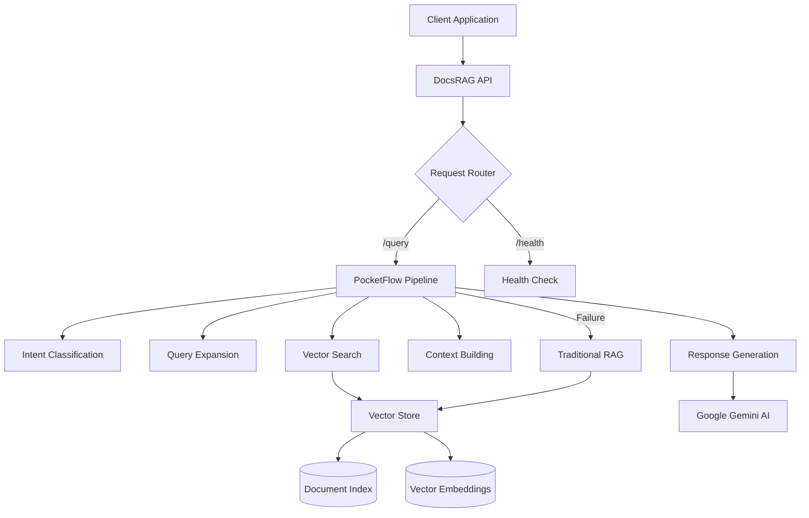

# DocsRAG API Overview

The DocsRAG API is a modern **TypeScript ESM-based RAG (Retrieval Augmented Generation) system** built with Hono.js that provides intelligent document search and query capabilities using AI embeddings.

## What is RAG?

**Retrieval-Augmented Generation (RAG)** combines the power of vector search with large language models to provide accurate, contextual answers from your documentation. Instead of relying solely on the LLM's training data, RAG retrieves relevant documents first, then generates responses based on that specific context.

## Key Features

### 🧠 **Dual Intelligence Architecture**
- **Primary Pipeline**: Advanced PocketFlow-based workflow system
- **Fallback Pipeline**: Traditional vector store with custom implementation
- **Smart Routing**: Automatic selection of the best processing path

### 🔍 **Advanced Search Capabilities**
- **Semantic Search**: AI-powered document retrieval using Google Gemini embeddings
- **Intent Classification**: Understands query types (how-to, troubleshooting, examples, etc.)
- **Query Expansion**: Automatically generates alternative phrasings for better results
- **Smart Chunking**: Intelligent document segmentation for optimal context

### ⚡ **Performance & Efficiency**
- **Incremental Indexing**: Only processes changed documents
- **File Hash Tracking**: Efficient change detection system
- **Memory Optimization**: Streaming document processing
- **Fast Responses**: Typically under 500ms query response time

### 🌐 **Developer Experience**
- **CORS Enabled**: Ready for cross-origin requests
- **TypeScript**: Full type safety and IntelliSense support
- **Modular Architecture**: Clean separation of concerns
- **Rich Metadata**: Detailed analytics and performance tracking
- **Health Monitoring**: Service status and availability endpoints

## Architecture Overview

## Technology Stack

### Core Framework
- **[Hono.js](https://hono.dev/)**: Fast, lightweight web framework
- **TypeScript**: Type-safe development with ESM modules
- **Node.js 18+**: Modern JavaScript runtime with ESM support

### AI & Machine Learning
- **[Google Gemini](https://ai.google.dev/)**: Advanced AI model for embeddings and text generation
- **[PocketFlow](https://www.npmjs.com/package/pocketflow)**: LLM workflow orchestration framework
- **Vector Similarity Search**: Custom implementation for document retrieval

### Storage & Processing
- **File-based Vector Store**: Efficient local storage with JSON persistence
- **Incremental Indexing**: Hash-based change detection and selective updates
- **Document Processing**: Markdown/MDX parsing with metadata extraction

## Use Cases

### 📚 **Documentation Sites**
Perfect for Docusaurus, GitBook, or any markdown-based documentation where users need to find specific information quickly.

### 🔧 **API Documentation**
Ideal for complex API docs where developers need contextual examples and implementation guidance.

### 📖 **Knowledge Bases**
Transform static knowledge bases into interactive, searchable systems that provide direct answers.

### 🎓 **Learning Resources**
Educational content that can answer student questions with relevant examples and explanations.

## Getting Started

Ready to integrate the DocsRAG API? Check out our guides:

- **[Quick Start Guide](./quick-start)** - Get up and running in 5 minutes
- **[API Reference](./api-reference)** - Complete endpoint documentation
- **[Configuration Guide](./configuration)** - Environment setup and customization
- **[Integration Examples](./examples)** - Real-world usage patterns

## What's Next?

The DocsRAG API is actively developed with upcoming features:

- **Multi-language Support**: Automatic language detection and translation
- **Advanced Analytics**: Query patterns and usage insights
- **Custom Embeddings**: Support for domain-specific embedding models
- **Real-time Updates**: Live document synchronization
- **Scale Features**: Distributed processing and clustering support

---

*Built with ❤️ for developers who believe documentation should be interactive and intelligent.*
